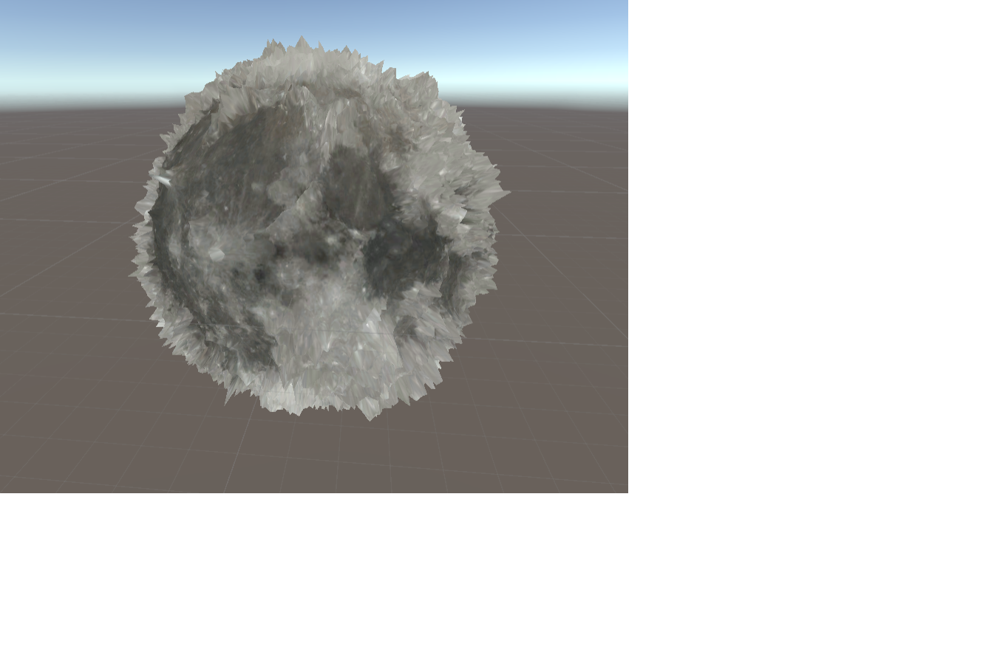

# テッセレーション

# 経過画像
色テクスチャを貼った球を作ろう 
 

ディスプレイスメントマップを別に読み込んで凹凸をつけよう 
 

陰影をつけよう 
 

月を壊してみよう 
 

月の破片をアニメーションさせてみよう A
 

かっこよくしてみよう 
 

# 補足
授業で作成したプロジェクトファイルをforkしたプロジェクトに上げてください。

srcフォルダにプロジェクトのファイルを入れてください。
.gitignore を反映させて、無駄なファイルをアップロードしないようにしてください。

工程に応じて、result+.pngファイルを置いてください(表示されることを確認すること)。

データの著作権に気を付けてください。

翌日以降の提出の際はプルリクを投げてください。
